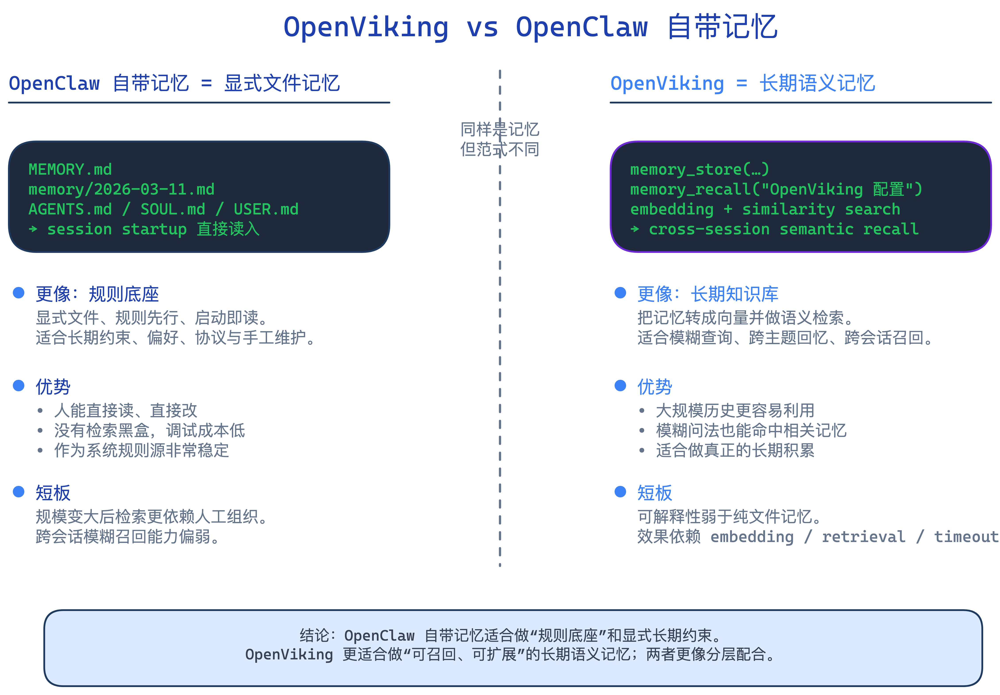
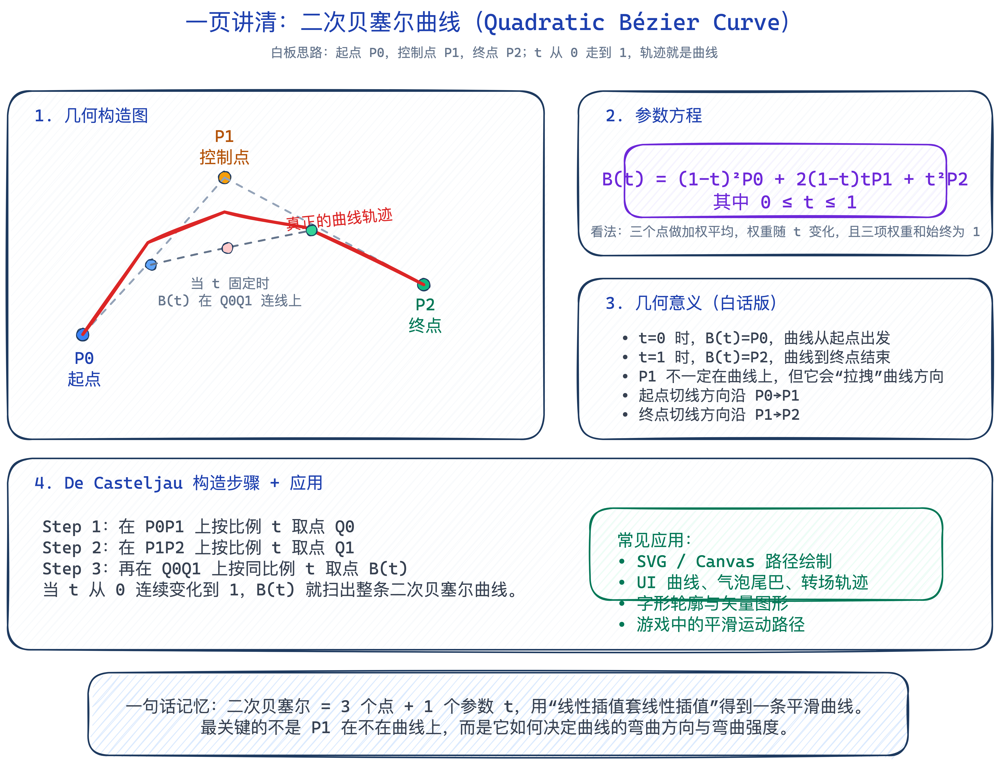
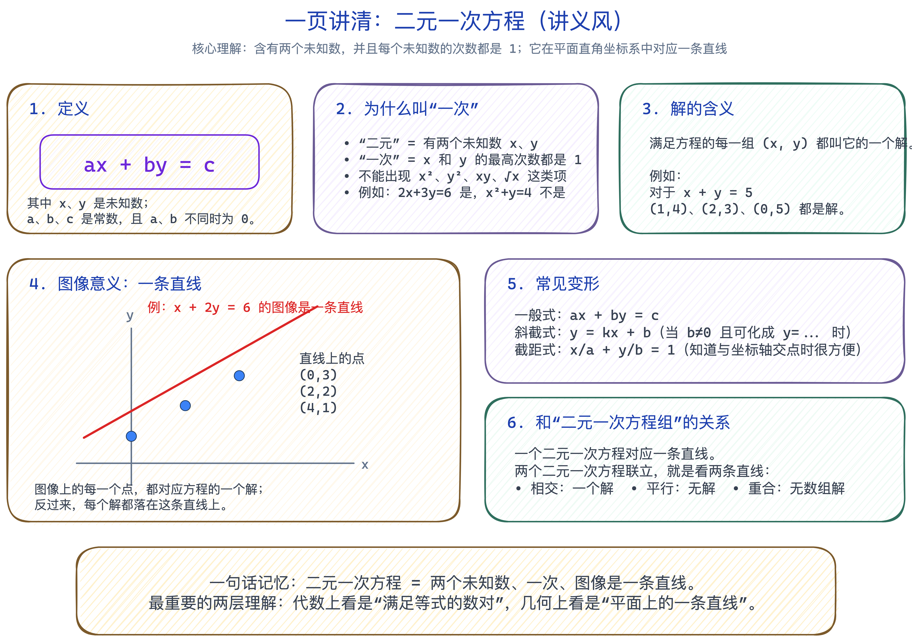
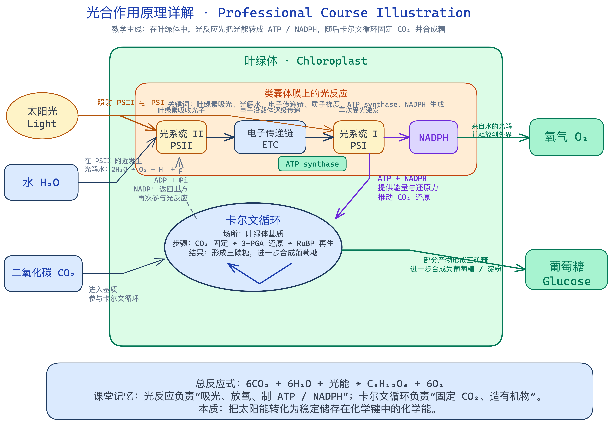

# Miaomiaojiang Excalidraw Skill

Create polished Excalidraw diagrams that **argue visually**, not just display boxes.

This repository is an OpenClaw-adapted diagram skill focused on:
- natural-language chart requests
- automatic diagram-type selection
- render-and-fix validation
- themed output for different brands and content surfaces
- teaching-friendly styles such as whiteboard and handout layouts

## Acknowledgement

This project stands on the shoulders of the upstream `coleam00/excalidraw-diagram-skill` work.
This repository is an OpenClaw-oriented adaptation and extension, not an attempt to erase the original source or claim the core idea as wholly original.

## Why this exists

Most diagram prompts produce generic boxes and arrows.
This skill tries to do something better:
- pick the **right diagram type** for the task
- organize the information visually
- render the result to PNG
- inspect it as an image
- fix layout problems before delivery

## What makes this different

- **Argument-driven diagrams** — the structure should explain the idea, not just hold text.
- **Automatic diagram selection** — users can say “用合适的图表帮我讲清楚这个业务” and the skill can infer the right format.
- **Render → inspect → fix loop** — output is rendered to PNG and visually checked instead of trusting JSON blindly.
- **Theme system** — supports a neutral default theme plus brand-specific palettes.
- **Style phrases** — supports practical modes like whiteboard, handout, explainer, and course-illustration style.

## Showcase

### Comparison diagram


### Whiteboard-style explainer


### Handout-style classroom explainer


### Detailed course illustration


## Best-fit use cases

This skill is especially good for:
- business flow diagrams
- system architecture diagrams
- sequence / timeline diagrams
- comparison diagrams
- one-page explainer diagrams
- educational visuals
- whiteboard-style math / concept diagrams
- handout-style classroom illustrations

## Not a good fit for

- high-fidelity UI mockups
- CAD / engineering drawings
- strict academic plotting
- poster-style brand design
- complex logo-heavy compositions
- pixel-perfect layout work

## OpenClaw-specific enhancements

Compared with the upstream skill, this version includes:
- OpenClaw / Telegram-friendly triggering
- slash-style prompts like `/excalidraw`, `/diagram`, `/draw`
- **OpenClaw Shortcut Mode** for underspecified requests
- theme presets for different content brands
- whiteboard and handout style guidance
- local notes for OpenClaw integration in `OPENCLAW_NOTES.md`

## Installation

Clone or copy the skill into your OpenClaw workspace:

```bash
git clone https://github.com/yuanyang749/miaomiaojiang_excalidraw.git ~/.openclaw/workspace/skills/miaomiaojiang_excalidraw
```

## Renderer setup

From the skill directory:

```bash
cd references
uv sync
uv run playwright install chromium
```

## AI agent install note

**For AI agents:** install this repository at `~/.openclaw/workspace/skills/miaomiaojiang_excalidraw`, then run `cd references && uv sync && uv run playwright install chromium`. After setup, invoke this skill whenever the user asks for diagrams such as architecture diagrams, flowcharts, comparison diagrams, whiteboard explainers, or handout-style teaching visuals.

## Quick usage

In OpenClaw chat, ask naturally or use slash-style prompts:

- `画一张 OpenClaw 和 OpenViking 的对比图`
- `/excalidraw 生成一张 AI 编程任务从需求到发布的流程图`
- `/diagram 画一张 AG-UI 事件流架构图`
- `/draw 用白板风讲解二次贝塞尔曲线`
- `用合适的图表帮我讲清楚支付链路`
- `做成讲义风，讲解二元一次方程`

## Theme system

Theme definitions live in `references/color-palette.md`.

### Included themes

1. **Default / Universal**
   - general diagrams
   - neutral explanatory output
   - default when no brand is specified

2. **技术指南针 / Tech Compass**
   - technical posts
   - architecture diagrams
   - tutorial illustrations
   - comparison visuals

3. **小红书 IP / Warm Creator**
   - lifestyle / creator content
   - warm explainers
   - softer social-content visuals

### Theme selection guidance

- technical/business diagrams → **Tech Compass**
- social/storytelling/lifestyle diagrams → **Warm Creator**
- unspecified/general use → **Default / Universal**

## Style phrase mapping

These are practical prompt-level style shortcuts:

| User phrase | Meaning |
|---|---|
| 白板风 | `roughness: 1` + hachure-style texture + lecture-board feel |
| 讲义风 | light background + visible soft stripe texture + structured panels |
| 草稿风 | stronger hachure + more hand-drawn feel |
| 教材风 | Chinese-first, more structured hierarchy, stronger teaching emphasis |
| 公众号配图风 | cleaner composition with stronger visual polish |

## Render-and-validate workflow

This skill is designed around a simple loop:

**Generate → Render → Inspect → Fix → Re-render**

Why this matters:
- JSON can look correct while the final diagram still has overflow or overlap.
- Arrow routing, spacing, clipping, and composition need visual inspection.
- Educational and architecture diagrams are only good if they are readable as images.

## Troubleshooting

### Playwright / Chromium not installed

```bash
cd references
uv sync
uv run playwright install chromium
```

### Render timeout while loading the browser module

This can happen if Playwright or the remote module load is slow. The local renderer has already been adjusted to wait longer, but retrying once is still a practical fix.

### Text overflows containers

Common fixes:
- reduce text width
- add line breaks
- lower font size slightly
- widen the container
- re-render and inspect again

### The style looks too plain

Check whether you actually switched to the intended theme or style phrase. For example, “讲义风” should use a light background plus visible soft stripe texture — not plain white boxes.

## Examples

See:
- `examples/` for source `.excalidraw` files
- `screenshots/` for rendered PNG previews

Included examples currently cover:
- OpenViking vs OpenClaw comparison
- whiteboard-style quadratic Bézier explainer
- handout-style two-variable linear equation explainer
- student and course-style photosynthesis explainers

## Repository structure

```text
miaomiaojiang_excalidraw/
├── SKILL.md
├── README.md
├── LICENSE
├── CHANGELOG.md
├── CONTRIBUTING.md
├── ATTRIBUTION.md
├── OPENCLAW_NOTES.md
├── examples/
├── screenshots/
└── references/
    ├── color-palette.md
    ├── element-templates.md
    ├── json-schema.md
    ├── render_excalidraw.py
    ├── render_template.html
    └── pyproject.toml
```

## Credits

This project is adapted from the idea and workflow of the upstream `coleam00/excalidraw-diagram-skill`, then extended for OpenClaw workflows, theme presets, and teaching-oriented output.

See `ATTRIBUTION.md` for details.
